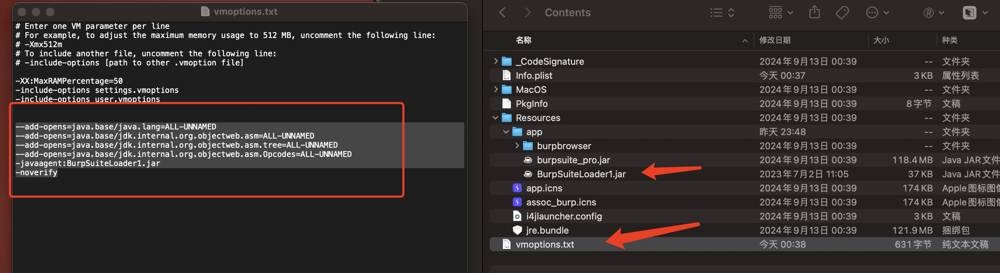

# macos上优雅的使用bp

直接官网下载最新版**安装包**，找到自己对应的系统类型，我这边下载的是`2024.8.1`


loader用的[52pojie](https://www.52pojie.cn/thread-1544866-1-1.html)的，respect！

为了更加优雅使用，只需要将`BurpSuiteLoader1.jar`复制到`/Applications/Burp Suite Professional.app/Contents/Resources/app/BurpSuiteLoader1.jar`


然后在`/Applications/Burp Suite Professional.app/Contents/vmoptions.txt`下面添加如下信息：
```
--add-opens=java.base/java.lang=ALL-UNNAMED
--add-opens=java.base/jdk.internal.org.objectweb.asm=ALL-UNNAMED
--add-opens=java.base/jdk.internal.org.objectweb.asm.tree=ALL-UNNAMED
--add-opens=java.base/jdk.internal.org.objectweb.asm.Opcodes=ALL-UNNAMED
-javaagent:BurpSuiteLoader1.jar
-noverify
```



loader注册过程和之前的一样，然后直接启动～


再次respect 52pojie！
